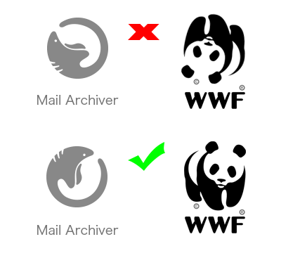

-   Production bundle throws error in IE11. Need Babel to output ES5.
-   If demo is going to be run in a dev server, json should be removed from app imports
-   Datepicker onclose function fires for both 'Ok' and 'Cancel'. Cancelling start datepicker still opens end datepicker!
-   Multiple varying color values need to be consolidated to a couple scss variables (consistency)
-   2 moderate security issues in dependencies. Fix with npm audit
-   If user changes sort order or sort column, a subsequent search disregards it. Search results need to be run through sort before rendering
-   Date range functionality needs to be modified to prevent future dates, end dates prior to start dates
-   Click area for opening datepicker should extend past date text
-   Should add transition animations for email body, http requests
-   Check with branding; logo character posture looks post-mortem. Compare with another logo that features an animal (see below). Rotate!
  
  
  - It is not clear what these '+1', '+2' indicators are suggesting. Need a better way to indicate multiple recipients.
  
  
  - It is not clear what this icon is suggesting. I still do not know what its purpose is.
  
 
